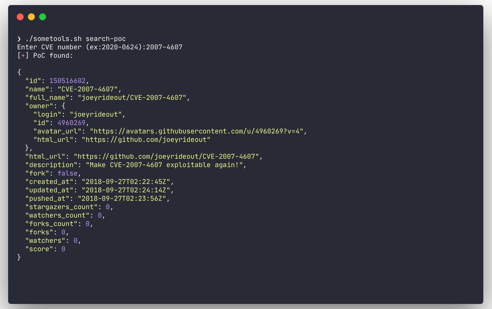

# Some-Tools

Manage all your pentest tools in one place and keep them up to date with one command 😎

The goal of sometools is to be able to manage all your tools that are not include in Kali or that `sudo apt install` is not available. Sometools works better if tools are a repo but it can be tweak to works without it.

## Why

I was looking for a way to manage and keep up to date some tools that are not included in Kali-Linux. For example, I was looking for an easy way to manage privilege escalation scripts. One day I saw sec-tools from eugenekolo (which you can see at the bottom of the page) and it gave me the motivation to start working on mine right away. My main motivation was the **check-update-all** command, which let you update all your installed tools smoothly.

But keep in mind that is different. I built this for people that are working with Kali. Should work on other distro but I didn't include tool like Burp Suite or SQLmap because it comes in Kali by default.

## Installation

```bash
$ git clone https://github.com/som3canadian/Some-Tools
$ cd Some-Tools
$ ./sometools.sh setup
# after setup, open new terminal or tab
$ ./sometools.sh list
# you can look in your .zshrc or .bashrc if you are not sure that the installation worked.
# For more info see Actions Detailed section.
```

## Basic usage


**Note**: No need to specify the category names when using a tool. Just use tool name or ID. You can see tool ID by doing `./sometools.sh list`

Most used actions are:

- list
- install
- check-update-all
- git-search
- self-update

```bash
# Inital setup. Should be the first command
$ ./sometools.sh setup
# List all available tools
$ ./sometools.sh list
# List all available tools of a category
$ ./sometools.sh list-cat Utilities
# List install tool(s)
$ ./sometools.sh list-installed
# List installed tools accessible from anywhere on your machine
$ ./sometool.sh list-bin
# Install a tool
$ ./sometools.sh install unicorn
# Using ID instead of tool name
$ ./sometools.sh install 4
# Install all tools of a Category
$ ./sometools.sh install-cat PrivEsc-Win
# Install All tools
$ ./sometools.sh install all
# Check update for all installed tools
# check-update-all command is the main reason why I made this
$ ./sometools.sh check-update-all
# Check for update
$ ./sometools.sh check-update PEAS
# Using ID instead of tool name
$ ./sometools.sh check-update 9
# Search for a tool on github
$ ./sometools.sh git-search LinEnum
# Search for a PoC in the PoC-in-GitHub tool
$ ./sometools.sh search-poc
# Show README.md of an installed tool
$ ./sometools.sh info unicorn
# Using ID instead of tool name
$ ./sometools.sh info 4
# Add a new tool
$ ./sometools.sh add-tool newtoolname PrivEsc-Lin
# Uninstall a tool
$ ./sometools.sh uninstall unicorn
# Using ID instead of tool name
$ ./sometools.sh uninstall 4
# Unistall all tools of a Category
$ ./sometools.sh uninstall-cat PrivEsc-Win
# Update some-tools
$ ./sometools.sh self-update
# Delete all installed tools, remove bin directory and delete our modification in .zshrc or .bashrc
$ ./sometools.sh complete-uninstall
```

## The Bin directory

- The bin directory will be created when doing the setup action. This will be the dir path that we will add to our shell $PATH (`your/install/dir/Some-Tools/bin`). In the bin dir we will put copy(symlink) of tool(s) that we want executable everywhere on our machine. For example a tool like `unicorn.py`, you may want to execute `unicorn` from everywhere you want.

- The setup action will aslo create `bin/PrivEsc-Lin` and `bin/PrivEsc-Win` in the process. In this directory we will keep our privilege escalation scripts. So, when you want to use your tools, you can fire a python http server and quickly upload the scripts you desire. The scripts in those folders **will be update at the same time you update the tool(s)** with check-update action.

## Tools List

### Summary

- 59 Tools

| Category      | Tool                                                                                       | Description                                                            |
|:--------------|:------------------------------------------------------------------------------------------ |:---------------------------------------------------------------------- |
| Evasion       | [Bashfuscator](https://github.com/Bashfuscator/Bashfuscator)                               | A fully configurable and extendable Bash obfuscation framework.|
| Evasion       | [Chimera](https://github.com/tokyoneon/Chimera)                                            | Chimera is a PowerShell obfuscation script designed to bypass AMSI and commercial antivirus solutions.|
| Evasion       | [PyFuscation](https://github.com/CBHue/PyFuscation)                                        | Obfuscate powershell scripts by replacing Function names, Variables and Parameters.|
| Evasion       | [tvasion](https://github.com/loadenmb/tvasion)                                             | :performing_arts: Anti virus evasion based on file signature change via AES encryption with Powershell and C#...|
| Evasion       | [unicorn](https://github.com/trustedsec/unicorn)                                           | Unicorn is a simple tool for using a PowerShell downgrade attack and inject shellcode straight into memory...|
| Exploit-Win   | [windows-kernel-exploits](https://github.com/SecWiki/windows-kernel-exploits)              | windows-kernel-exploits   Windows平台提权漏洞集合|
| PrivEsc-Lin   | [BeRoot](https://github.com/AlessandroZ/BeRoot)                                            | Privilege Escalation Project - Windows / Linux / Mac|
| PrivEsc-Lin   | [LinEnum](https://github.com/rebootuser/LinEnum)                                           | Scripted Local Linux Enumeration <> Privilege Escalation Checks|
| PrivEsc-Lin   | [LinPwn](https://github.com/3XPL017/LinPwn)                                                | Interactive Post Exploitation Tool|
| PrivEsc-Lin   | [PEAS](https://github.com/carlospolop/privilege-escalation-awesome-scripts-suite)          | PEASS - Privilege Escalation Awesome Scripts SUITE  |
| PrivEsc-Lin   | [SUID3NUM](https://github.com/Anon-Exploiter/SUID3NUM)                                     | A standalone python script which utilizes python's built-in modules to enumerate SUID binaries...  |
| PrivEsc-Lin   | [SetUID](https://github.com/AlessandraZullo/SetUID.git)                                    | My personal guide to get privesc                             |
| PrivEsc-Lin   | [linux-enum-mod](https://github.com/kevthehermit/pentest)                                  | Just a collection of pentest stuffs    |
| PrivEsc-Lin   | [linux-exploit-suggester](https://github.com/mzet-/linux-exploit-suggester)                | Linux privilege escalation auditing tool |
| PrivEsc-Lin   | [linux-exploit-suggester-2](https://github.com/jondonas/linux-exploit-suggester-2)         | Next-Generation Linux Kernel Exploit Suggester   |
| PrivEsc-Lin   | [linuxprivchecker](https://github.com/sleventyeleven/linuxprivchecker.git)                 | a Linux Privilege Escalation Check Script    |
| PrivEsc-Lin   | [lse](https://github.com/diego-treitos/linux-smart-enumeration)                            | Linux enumeration tool for pentesting and CTFs with verbosity levels |
| PrivEsc-Lin   | [pspy](https://github.com/DominicBreuker/pspy)                                             | Monitor linux processes without root permissions  |
| PrivEsc-Lin   | [setuid-wrapper](https://github.com/jfredrickson/setuid-wrapper)                           | A simple setuid wrapper program, intended to launch shell scripts with elevated privileges. |
| PrivEsc-Lin   | [unix-privesc-check](https://github.com/pentestmonkey/unix-privesc-check)                  | Automatically exported from code.google.com/p/unix-privesc-check |
| PrivEsc-Win   | [Ghostpack-CompiledBinaries](https://github.com/r3motecontrol/Ghostpack-CompiledBinaries)  | Compiled Binaries for Ghostpack (.NET v4.0)  |
| PrivEsc-Win   | [JAWS](https://github.com/411Hall/JAWS)                                                    | JAWS - Just Another Windows (Enum) Script  |
| PrivEsc-Win   | [Powerless](https://github.com/M4ximuss/Powerless)                                         | nuWindows privilege escalation (enumeration) script designed with OSCP labs (legacy Windows) in mind  |
| PrivEsc-Win   | [Privesc](https://github.com/enjoiz/Privesc)                                               | Windows batch script that finds misconfiguration issues which can lead to privilege escalation.   |
| PrivEsc-Win   | [SessionGopher](https://github.com/Arvanaghi/SessionGopher)                                | SessionGopher is a PowerShell tool that uses WMI to extract saved session information for remote access...  |
| PrivEsc-Win   | [Sherlock](https://github.com/rasta-mouse/Sherlock)                                        | PowerShell script to quickly find missing software patches for local privilege escalation vulnerabilities.   |
| PrivEsc-Win   | [WinPwn](https://github.com/S3cur3Th1sSh1t/WinPwn)                                         | Automation for internal Windows Penetrationtest / AD-Security |
| PrivEsc-Win   | [Windows-Privilege-Escalation](https://github.com/frizb/Windows-Privilege-Escalation)      | Windows Privilege Escalation Techniques and Scripts   |
| PrivEsc-Win   | [Windows-Exploit-Suggester](https://github.com/AonCyberLabs/Windows-Exploit-Suggester)     | This tool compares a targets patch levels against the Microsoft vulnerability database...  |
| PrivEsc-Win   | [mimikatz](https://github.com/gentilkiwi/mimikatz)                                         | A little tool to play with Windows security    |
| PrivEsc-Win   | [wesng](https://github.com/bitsadmin/wesng)                                                | Windows Exploit Suggester - Next Generation    |
| PrivEsc-Win   | [windows-privesc-check](https://github.com/pentestmonkey/windows-privesc-check)            | Standalone Executable to Check for Simple Privilege Escalation Vectors on Windows Systems     |
| Utilities     | [GraphQLmap](https://github.com/swisskyrepo/GraphQLmap)                                    | GraphQLmap is a scripting engine to interact with a graphql endpoint for pentesting purposes.   |
| Utilities     | [PoC-in-GitHub](https://github.com/nomi-sec/PoC-in-GitHub)                                 | 📡 PoC auto collect from GitHub. :warning: Be careful Malware. |
| Utilities     | [SirepRAT](https://github.com/SafeBreach-Labs/SirepRAT)                                    | Remote Command Execution as SYSTEM on Windows IoT Core (releases available for Python2.7 <> Python3)    |
| Utilities     | [Windows-Tools](https://github.com/som3canadian/Windows-Tools)                             | Some Windows Tools.  |
| Utilities     | [chisel](https://github.com/jpillora/chisel)                                               | A fast TCP/UDP tunnel over HTTP    |
| Utilities     | [crackhash](https://github.com/5h4d0wb0y/crackhash)                                        | Crackhash is a tool that try to crack different types of hashes using free online services.      |
| Utilities     | [cryptz](https://github.com/iinc0gnit0/cryptz)                                             | :lock: [ Multi Encryption / Decryption ] :unlock:  |
| Utilities     | [decodify](https://github.com/s0md3v/Decodify)                                             | Detect and decode encoded strings, recursively. |
| Utilities     | [enum4linux-ng](https://github.com/cddmp/enum4linux-ng)                                    | A next generation version of enum4linux (a Windows/Samba enumeration tool) with additional features ...|
| Utilities     | [evil-winrm](https://github.com/Hackplayers/evil-winrm)                                    | The ultimate WinRM shell for hacking/pentesting |
| Utilities     | [haiti](https://github.com/noraj/haiti)                                                    | :key: Hash type identifier (CLI <> lib)                                            |
| Utilities     | [impacket](https://github.com/SecureAuthCorp/impacket)                                     | Impacket is a collection of Python classes for working with network protocols.        |
| Utilities     | [nishang](https://github.com/samratashok/nishang)                                          | Nishang - Offensive PowerShell for red team, penetration testing and offensive security.         |
| Utilities     | [nmapAutomator](https://github.com/21y4d/nmapAutomator)                                    | A script that you can run in the background!                                    |
| Utilities     | [pypykatz](https://github.com/skelsec/pypykatz)                                            | Mimikatz implementation in pure Python                                       |
| Utilities     | [revshellgen](https://github.com/t0thkr1s/revshellgen)                                     | Reverse shell generator written in Python 3.         |
| Utilities     | [snmp](https://github.com/dheiland-r7/snmp)                                                | SNMP data gather scripts   |
| Web           | [byp4xx](https://github.com/lobuhi/byp4xx)                                                 | Pyhton script for HTTP 40X responses bypassing...      |
| Web           | [fuxploider](https://github.com/almandin/fuxploider)                                       | File upload vulnerability scanner and exploitation tool.            |
| Web           | [LFISuite](https://github.com/D35m0nd142/LFISuite)                                         | Totally Automatic LFI Exploiter (+ Reverse Shell) and Scanner.  |
| Web           | [MyJWT](https://github.com/mBouamama/MyJWT)                                                | A cli for cracking, testing vulnerabilities on Json Web Token(JWT)    |
| Web           | [php-reverse-shell](https://github.com/ivan-sincek/php-reverse-shell)                      | PHP reverse shell script. Works on Linux OS, macOS, and Windows OS.        |
| Web           | [windows-php-reverse-shell](https://github.com/Dhayalanb/windows-php-reverse-shell)        | Simple php reverse shell implemented using binary .   |
| Web           | [wwwolf-php-webshell](https://github.com/WhiteWinterWolf/wwwolf-php-webshell)              | WhiteWinterWolf's PHP web shell |
| Web           | [malicious-wordpress-plugin](https://github.com/wetw0rk/malicious-wordpress-plugin)        | Simply generates a wordpress plugin that will grant you a reverse shell once uploaded.    |
| Web           | [whitepass](https://github.com/cyberstruggle/whitepass)                                    | Whitepass Bypass Whitelist/Ratelimit Implementations in Web Applications/APIs             |
| Web           | [wordpress-exploit-framework](https://github.com/rastating/wordpress-exploit-framework)    | A Ruby framework designed to aid in the penetration testing of WordPress systems.         |


Note:

- PEAS include both linPEAS and winPEAS scripts
- BeRoot include both Linux and Windows scripts

## Actions Detailed

- **setup** (Setup Process):
  - **This should be the first command you run.**
  - First it will ask you which shell you want to use between `.bashrc` or `.zshrc` (built in setup action will not work if you are not using one of the two shell)
  - The script will set $SOME_ROOT variable
  - After the setup, You can open new terminal tabs/windows or source your shell (.bashrc or .zshrc) in the current terminal to activate the new path. To see you new path after you can do `echo $PATH`
  - In you shell file (.bashrc or .zshrc), we will copy you $PATH before we make modification. It will be commented few lines before the end of your shell file. So if you want to reset your path to before Some-Tools setup you can copy the command commented in you shell file, cleanup what we created in the file and finally source it.
  - Creation of Bin directory. (bin, bin/PrivEsc-Lin and bin/PrivEsc-Win)
  - You can read the setup section in `sometools.sh` to have a better understanding.

  ```bash
  $ ./sometools.sh setup
  ```

- **install** and **install-all**:
  - Install one tool or all tools.
  - If you install only one tool, instead of using tool name, you can use is ID number showed when you do `./sometools.sh list`.
  - When you will install a tool, it will create a `.installed` file in the tool dir. This file will help us with our list-installed action.

  ```bash
  $ ./sometools.sh list # see which tool can be install
  # install a tool
  $ ./sometools.sh install LinEnum
  # example using an ID number
  $ ./sometools.sh install 7
  # installing all tools
  $ ./sometools.sh install-all
  ```

- **install-cat** and **uninstall-cat**:
  - Install all tools of a category.
  - Uninstall all tools of a category.

  ```bash
  # install cat
  $ ./sometools.sh install-cat PrivEsc-Win
  # uninstall cat
  $ ./sometools.sh uninstall-cat PrivEsc-Win
  ```

- **check-update** and **check-update-all**:
  - Check update for an installed tool or all installed tools
  - check-update works for tools coming from a git repo. If you add a new tools that is not a git repo(`.git` dir), you can make an `update-tool.sh` file with your specials instructions (file must be name `update-tool.sh`).
  - If you check-update only one tool, instead of using tool name, you can use is ID number showed when you do `./sometools.sh list`.

  ```bash
  $ ./sometools.sh list-installed # list currently installed tool(s)
  $ ./sometools.sh check-update LinEnum
  # example using an ID number
  $ ./sometools.sh check-update 7
  # example with check-update-all
  $ ./sometools.sh check-update-all
  ```

  - Why two check-git ? check-git.sh only tell if the tool is behind or not. If we detect a newer version, we will ask to execute check-git-action.sh.

- **git-search**
  - Search a repo on github
  - Result will be sort by number of stars (you can change the `sortSearch` variable if you want)
  - By default, number of results will be 10

  ```bash
  $ ./sometools.sh git-search LinEnum
  # Output more results. Example with 15 (default is 10)
  $ ./sometools.sh git-search LinEnum 15
  ```

  

- **search-poc**
  - Search for a PoC in the PoC-in-GitHub tool
  - To be able to use that function, PoC-in-GitHub tool have to be installed.

  ```bash
  $ ./sometools.sh search-poc
  ```

  

- **self-update**:
  - That function help keeping this tool (Some-Tools) up to date. If you are behind it will ask you if you want to `pull`.

  ```bash
  $ ./sometools.sh self-update
  ```

- **uninstall**:
  - Uninstall an installed tool.
  - Instead of using tool name, you can use is ID number showed when you do `./sometools.sh list`.

  ```bash
  $ ./sometools.sh uninstall unicorn
  # example using an ID number
  $ ./sometools.sh uninstall 4
  ```

- **add-tool**:
  - add-tool will create your new directory in the category you have specified. It will also create 3 files in this directory: `install-tool.sh`, `uninstall-tool.sh` and `.gitignore`.
  - Looking other tools will help you understand how add yours. It's quite easy. Its 3 files, which `add-tool` action will create for you.
  - When adding a tool I strongly suggest naming the tool the same of their repo. It will be more easy to use check-update action after. But if you want a different name, you can see an example with `lse` tool in `PrivEsc-Lin` directory. You may have to change the `.gitignore` file in your tool directory.
  - If your tool is not a git repo, there is no worry. But you will have to modify `install-tool.sh` file to fit your needs. If you do so, the check-update action will not work "out of the box" (because we won't find any .git directory). Solution: you can create a file **name** `update-tool.sh` (in the tool directory) and put your update commands in it. The `some-tools.sh` script will detect this file name when using check-update action. Don't forget to `chmod +x` your new file.
  - `.gitignore` will contain your tool name and `.installed`. Why ? Because we dont want to push git repo into another repo and we dont want to push `.installed` file.

  ```bash
  $ ./sometools.sh add-tool newtoolname PrivEsc-Lin
  # better example ?
  $ ./sometools.sh add-tool LinEnum PrivEsc-Lin
  ```

- **install-tool and update-tool with Github API**
  
  Sometimes tools need to be downloaded via the releases/latest page like pspy from DominicBreuker. So to be able to always update and download the latest version, the process needed a little twist with the Github API. If you add a new tool using this pattern, you can use the function bellow in your install-tool.sh and update-tool.sh files.

  ```bash
  #!/bin/bash

  # in this exemple we will download all executables of pspy.
  function gitGetLatestRelease() {
    gitCounter=0
    repoToGet="DominicBreuker/pspy"
    apiURL="https://api.github.com/repos"
    while [[ $checkDownloadURL != null ]]; do
      checkDownloadURL=$(http "$apiURL/$repoToGet/releases/latest" | jq -r ".assets[$gitCounter].browser_download_url")
      if [[ $checkDownloadURL == null ]]; then
        break
      fi
      # download the release
      wget "$checkDownloadURL"
      gitCounter=$((gitCounter + 1))
    done
  }
  gitGetLatestRelease
  ```

- **info**:
  - Show the README.md file of an installed tool.
  - Instead of using tool name, you can use is ID number showed when you do `./sometools.sh list`.
  - [Bat](https://github.com/sharkdp/bat) or cat ?
  - I love using bat instead of cat, so when `info` action is used, some-tools will try to detect the `bat` binary. If it does it will ask you between `bat` or `cat`.
  - If you don't know what I'm takling about, don't worry `cat` will be use by default without asking if no `bat` detected.

  ```bash
  $ ./sometools.sh info LinEnum
  # example using an ID number
  $ ./sometools.sh info 7
  ```

- **complete-uninstall**:
  - Delete all installed tools, remove bin directory and delete our modification in `.zshrc` or `.bashrc`.
  - We will delete only some-tools section in your `.zshrc` or `.bashrc` file. So if you made some modifications along the way, they will be kept.
  - Af the complete uninstall, you should have 3 `.zshrc` or `.bashrc` file. One finishing with `.backup` that we created at the initial setup and the second one, `.backup2`, before deleting sometools section in the complete-uninstall process.

  ```bash
  $ ./sometools.sh complete-uninstall
  ```

## Zsh Functions

- Zsh functions does not contain any pentest tools, it contains little script that help my  workflow a lot and I thought it would be useful to others too.

- Maybe it could be use with other shell but I use it with zsh.

- This **won't** be set during the setup process. You have to set it manually. How ? By adding the snippet below to your `.zshrc` file.

```bash
# Custom functions dir
# make sure to modify the path below to fit your need
fpath=(~/path/of/sometools/Zsh-Functions $fpath);
autoload -U $fpath[1]/*(.:t)
```

- mkcd: mkdir and cd
- mv: move a file/folder into your current directory (with one argument)
- op: open file or folder in file manager (`op .` to open current directory)

## Others

- When using the ID number instead of tool name, be sure to use the ID number from `./sometools.sh list` and not `./sometools.sh list-installed`
- If you add a new tool that needs specific update instructions, you can create the file `update-tool.sh` in the tool dir (like the install-tool.sh and uninstall-tool.sh file). When you will check-update, the some-tools.sh script will take it in consideration.
- You **can't** use the same name for two tools. It will cause problems. When using add-tool action, we will check for that. A solution for that would be to specify category name when using an action but I **really don't want that**. Since using a different name is easy, I have no intention for the moment to develop a solution that will let us use the same name for multiple tools.
- Some of the tool you will install may ask you for `sudo` permissions !
- The `check-git.sh` file include in the repo is for the check-update and check-update-all actions.
- I'm building this on my free time, may have some bugs. If stars start to grow, I may put more time and effort.

## License

The individual tools are all licensed under their own licenses. As for Some-Tools, it is licensed under GNU General Public License v3.0.

⭐ If you find it useful, star it at the top of this page ⭐ or you can buy me a ☕. Thank You 🔥😎

<a href="https://www.buymeacoffee.com/somecanadian" target="_blank"></a>

## Acknowledgements

- Built from the idea of <https://github.com/eugenekolo/sec-tools> and <https://github.com/zardus/ctf-tools>.
- Vagrant box by: [nicmilot](https://app.vagrantup.com/nicmilot/boxes/kali-full-2020). You can see his others vagrant boxes like: [pwk-kali-2018](https://app.vagrantup.com/nicmilot/boxes/pwk-kali-2018) for VMware Fusion and [Metapsloitable3](https://app.vagrantup.com/nicmilot/boxes/metasploitable3-win2008-vmware) for VMware Fusion too.
